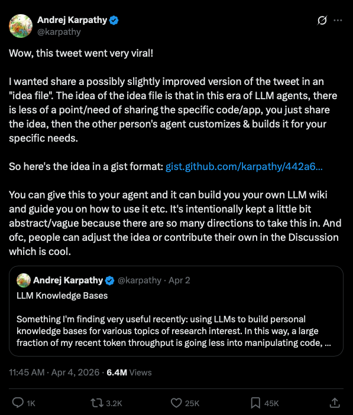
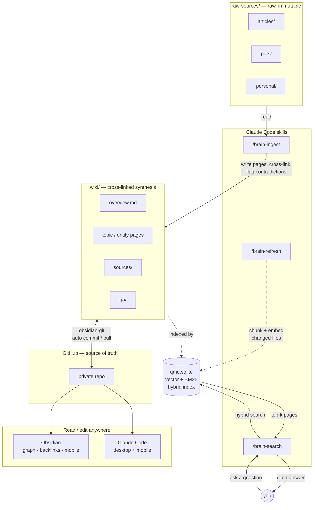

# :classical_building: claude-second-brain

**Your notes don't compound. This wiki does.**

[](https://www.npmjs.com/package/claude-second-brain) [](https://opensource.org/licenses/MIT) [](https://deepwiki.com/jessepinkman9900/claude-second-brain)


The fastest way to start your personal knowledge base powered by Obsidian, Claude Code, qmd, and GitHub.


```
npx claude-second-brain
```

One command gives you a fully wired knowledge system:
- [Claude](https://claude.ai/) ingests your sources and maintains a cross-linked wiki
- [qmd](https://github.com/tobi/qmd) powers local semantic search
- The scaffolded folder **is your Obsidian vault** — open it directly in [Obsidian](https://obsidian.md), with [obsidian-git](https://github.com/Vinzent03/obsidian-git) pre-configured for seamless sync
- GitHub is the source of truth — version history, anywhere access, and a backup you control

You've been reading papers, articles, and books for years. Drop a source in, run `/brain-ingest`, and Claude reads it — extracts what matters, cross-links it to everything you already know, and files it. Ask a question six months later and get cited answers, not a list of files to re-read.

> **Inspired by [Andrej Karpathy's approach to LLM-powered knowledge management](https://x.com/karpathy/status/2040470801506541998?s=20)** — share an "idea file" with an LLM agent and let it build and maintain your knowledge base.



---


## How this is different

This is not a RAG system. It's not a chatbot over your notes. It's an actively maintained, cross-linked wiki — five structured page types, YAML frontmatter, and a set of Claude Code skills that run the whole thing.


The schema (`CLAUDE.md`) is that idea file. Claude reads it every session.

---

## The stack

| Tool | Role |
|---|---|
| **Claude Code** | Reads sources, writes wiki pages, cross-links, flags contradictions |
| **qmd** | Local hybrid search (vector + BM25) across your entire wiki |
| **Obsidian** | Graph view, backlinks, mobile reading — offline, no extra sync |
| **GitHub** | Source of truth — version history, Claude Code anywhere, Obsidian sync |

Everything is pre-configured. You bring the sources.

---

## Get started in 3 steps

**Step 1 — Scaffold**

```bash
npx claude-second-brain
```

The CLI will ask:
- **Folder name** — where to create your vault (default: `my-brain`)
- **qmd index path** — where to store the local search index (default: `~/.cache/qmd/index.sqlite`)
- **GitHub repo** — optionally create a private repo and push automatically (requires `gh` CLI)

Then scaffolds the vault, installs `mise` + `bun`, and runs `git init`.

**Step 2 — Initialize inside Claude Code**

```bash
cd my-brain && claude
```

Then run:

```
/setup
```

Registers the qmd collections and generates local vector embeddings. First run downloads ~2GB of GGUF models — once.

**Step 3 — Open in Obsidian (and push to GitHub if not done)**

**If you created a GitHub repo during setup**, it's already pushed — skip straight to opening in Obsidian.

**If you skipped GitHub during setup**, connect it now:

```bash
git remote add origin https://github.com/you/my-brain.git
git push -u origin main
```

Open `my-brain/` as a vault in Obsidian — the folder is already a valid Obsidian vault. The Git plugin is pre-configured — enable it and sync is automatic.

---

## Claude Code skills included

The wiki ships with a set of slash commands that cover the full workflow. No manual prompting, no copy-pasting.

### Daily workflow

**`/brain-ingest`** — Drop a file into `raw-sources/articles/`, `raw-sources/pdfs/`, or `raw-sources/personal/`. Run `/brain-ingest`. Claude summarizes the source, asks what matters most to you, creates a `wiki/sources/` page, updates or creates related topic pages, flags any contradictions with existing knowledge, and logs everything.

**`/brain-search`** — Ask anything about what you know. Claude runs hybrid semantic search across the wiki, reads the most relevant pages, and writes an answer with inline `[[wiki/page]]` citations. If the answer synthesizes multiple pages in a novel way, it offers to file it as a permanent `wiki/qa/` entry.

**`/lint`** — Health-check the wiki. Surfaces orphan pages, broken links, unresolved contradictions, and data gaps. Reports findings and applies fixes where possible.

### Maintenance

**`/brain-refresh`** — Re-scan the vault for new or changed files and regenerate vector embeddings. Run after a bulk ingest session or manual edits. Pass `force` to re-embed every chunk (e.g. after changing the embedding model).

**`/brain-rebuild`** — **Destructive.** Redesigns the qmd schema: analyzes the wiki, proposes new collections and contexts, waits for your approval, then patches `scripts/qmd/setup.ts`, drops the old index, and rebuilds embeddings from scratch. Use only when the current structure no longer fits how you search.

### Setup

**`/setup`** — First-time initialization. Registers the qmd collections and generates local vector embeddings. Run once after scaffolding.

---

## Access from anywhere

**Edit anywhere — Claude Code on desktop or mobile**
Claude Code's GitHub integration lets you open the repo and work from anywhere — ingest a source, run a query, or update a page from your phone.

**Read anywhere — Obsidian desktop and mobile**
Open the repo as an Obsidian vault. The bundled `.obsidian` folder pre-configures the [obsidian-git](https://github.com/Vinzent03/obsidian-git) community plugin — no setup required, just enable it. Your wiki syncs automatically on every commit. For iOS: put the repo folder inside iCloud Drive — Obsidian Mobile picks it up natively with no extra setup. Graph view, backlinks, offline reading — all working.

**Browse anywhere — GitHub**
It's a plain GitHub repo. View and edit files directly in the browser at any time.

---

## How it works

Sources flow in on the left, Claude synthesizes them into the wiki, qmd indexes every page into a local hybrid search index, and GitHub makes the whole vault editable from Obsidian and Claude Code on any device.



### The ingest loop, zoomed in

```
┌─────────────────────┐        ┌─────────────────────┐        ┌─────────────────────┐
│   Drop in a source  │        │ /brain-ingest       │        │     Wiki grows      │
│                     │        │        Code         │        │                     │
│  · article          │──────▶ │                     │──────▶ │  · cross-linked     │
│  · PDF              │        │  reads + extracts   │        │    pages            │
│  · personal note    │        │  key knowledge      │        │  · contradictions   │
│                     │        │                     │        │    flagged          │
└─────────────────────┘        └─────────────────────┘        │  · syntheses        │
                                                              │    written          │
                                                              └─────────────────────┘
```

Query it anytime with `/brain-search`. Get answers with inline `[[wiki/page]]` citations, not a list of files.

---

## Wiki structure

Five page types, all with YAML frontmatter:

| Type | File | Purpose |
|---|---|---|
| `overview` | `wiki/overview.md` | Evolving high-level synthesis |
| `topic` | `wiki/[concept].md` | A concept, domain, or idea |
| `entity` | `wiki/[name].md` | A person, tool, company, or project |
| `source-summary` | `wiki/sources/[slug].md` | One page per ingested source |
| `qa` | `wiki/qa/[slug].md` | Filed answers to notable queries |

All pages cross-link with Obsidian `[[wikilinks]]`. Contradictions are flagged with `[!WARNING]` callouts. Full schema in [CLAUDE.md](./CLAUDE.md).

---

## Directory layout

```
my-brain/
├── CLAUDE.md              ← The schema. Claude reads this every session.
├── raw-sources/           ← Your raw inputs. Claude never modifies these.
│   ├── articles/
│   ├── pdfs/
│   └── personal/
├── wiki/                  ← Claude owns this entirely.
│   ├── index.md
│   ├── log.md
│   ├── overview.md
│   ├── sources/
│   └── qa/
└── scripts/qmd/           ← Semantic search setup and re-indexing
```

---

## Installing and updating skills

Skills are slash commands Claude Code loads from `.claude/skills/[name]/SKILL.md`. `/brain-ingest`, `/brain-search`, and `/brain-refresh` install globally to `~/.claude/skills/` during setup so they work in any Claude Code session. `/brain-rebuild`, `/lint`, `/setup`, and `/qmd-cli` live inside the vault at `.claude/skills/`.

### Update the built-in wiki skills

The wiki's own skills are scaffolded at creation time. To pull in improvements, use `npx skills` pointing to the template skills directory in this repo:

```bash
# Install or update all 7 wiki skills from the latest template
npx skills add https://github.com/jessepinkman9900/claude-second-brain/tree/main/template/.claude/skills -a claude-code -y

# Or update a specific skill
npx skills add https://github.com/jessepinkman9900/claude-second-brain/tree/main/template/.claude/skills --skill brain-ingest -a claude-code -y
```

Once installed via `npx skills`, future updates are a single command:

```bash
npx skills update -a claude-code
```

---

## Roadmap

- [ ] GitHub Actions to invoke `/brain-refresh` on a schedule
- [ ] GitHub agentic workflows — auto-ingest on push, scheduled lint, auto-summary on new sources
- [ ] More Claude Code skills (source discovery, topic clustering)

---

## Requirements

- [mise](https://mise.jdx.dev/) — auto-installed by the CLI if missing
- [Claude Code](https://claude.ai/code) — the CLI that runs the wiki
- [Obsidian](https://obsidian.md/) — optional but recommended

---

## License

MIT
