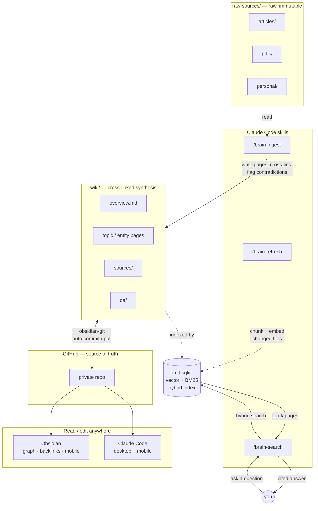

## How it works

Sources flow in on the left, Claude synthesizes them into the wiki, qmd indexes every page into a local hybrid search index, and GitHub makes the whole vault editable from Obsidian and Claude Code on any device.



### The ingest loop, zoomed in

```
┌─────────────────────┐        ┌─────────────────────┐        ┌─────────────────────┐
│   Drop in a source  │        │ /brain-ingest       │        │     Wiki grows      │
│                     │        │                     │        │                     │
│  · article          │──────▶ │  reads + extracts   │──────▶ │  · cross-linked     │
│  · PDF              │        │  key knowledge      │        │  · contradictions   │
│  · personal note    │        │                     │        │    flagged          │
│                     │        │                     │        │  · syntheses        │
└─────────────────────┘        └─────────────────────┘        └─────────────────────┘
```

Query it anytime with `/brain-search`. Get answers with inline `[[wiki/page]]` citations, not a list of files.

### Directory layout

```
my-brain/
├── CLAUDE.md              ← The schema. Claude reads this every session.
├── raw-sources/           ← Your raw inputs. Claude never modifies these.
│   ├── articles/
│   ├── pdfs/
│   └── personal/
├── wiki/                  ← Claude owns this entirely.
│   ├── index.md
│   ├── log.md
│   ├── overview.md
│   ├── sources/
│   └── qa/
└── scripts/qmd/           ← Semantic search setup and re-indexing
```
