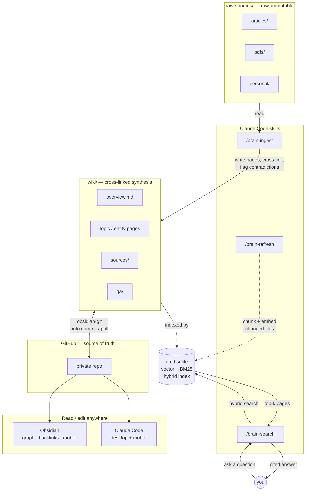

# __BRAIN_NAME__

built using [claude-second-brain](https://github.com/jessepinkman9900/claude-second-brain)

**Your notes don't compound. This wiki does.**

Drop in a source. Claude reads it, extracts what matters, cross-links it to everything you already know, and files it. Query it six months later and get cited answers — not a list of files to re-read.

Inspired by [Andrej Karpathy's approach to LLM-powered knowledge management](https://x.com/karpathy/status/2040470801506541998?s=20).

---

## Quick start

```bash
# 1. Install tools (node + pnpm via mise)
mise install

# 2. Install dependencies
pnpm install

# 3. Open Claude Code
claude
```

Inside Claude Code, run:

```
/setup
```

Registers the qmd collections and generates local vector embeddings. First run downloads ~2GB of GGUF models — once.

**Then open this folder in Obsidian.** The Git plugin is pre-configured — enable it in Obsidian settings and your wiki syncs automatically.

---

## Your Claude Code skills

### Daily workflow

**`/brain-ingest`** — Add a file to `raw-sources/articles/`, `raw-sources/pdfs/`, or `raw-sources/personal/`, then run `/brain-ingest`. Claude summarizes the source, asks what aspects matter most, updates related wiki pages, flags contradictions, and logs everything.

**`/brain-search`** — Ask anything: `what do I know about [topic]?` Claude searches the wiki semantically and returns a cited answer. If it synthesizes multiple pages in a useful way, it offers to file it as a permanent `wiki/qa/` entry.

**`/lint`** — Health-check the wiki. Finds orphan pages, broken links, unresolved contradictions, and data gaps. Reports findings and fixes what it can.

### Maintenance

**`/brain-refresh`** — Re-scan the vault for new or changed files and regenerate vector embeddings. Run after a bulk ingest session or manual edits. Pass `force` to re-embed every chunk.

**`/brain-rebuild`** — **Destructive.** Redesigns the qmd schema: analyzes the wiki, proposes new collections and contexts, waits for your approval, then patches `scripts/qmd/setup.ts`, drops the old index, and rebuilds embeddings from scratch.

### Setup

**`/setup`** — First-time initialization. Registers the qmd collections and generates local vector embeddings. Run once after scaffolding.

---

## How it works

Sources flow in on the left, Claude synthesizes them into the wiki, qmd indexes every page into a local hybrid search index, and GitHub makes the whole vault editable from Obsidian and Claude Code on any device.



---

## Obsidian Mobile

If this repo lives inside your iCloud Drive folder, Obsidian Mobile reads it with no extra setup. Graph view, backlinks, offline access — all working. The Git plugin handles sync automatically when you commit and push.

---

## Wiki structure

Five page types, all with YAML frontmatter:

| Type | File | Purpose |
|---|---|---|
| `overview` | `wiki/overview.md` | Evolving high-level synthesis |
| `topic` | `wiki/[concept].md` | A concept, domain, or idea |
| `entity` | `wiki/[name].md` | A person, tool, company, or project |
| `source-summary` | `wiki/sources/[slug].md` | One page per ingested source |
| `qa` | `wiki/qa/[slug].md` | Filed answers to notable queries |

All pages cross-link with Obsidian `[[wikilinks]]`. Contradictions are flagged with `[!WARNING]` callouts. Full schema in [CLAUDE.md](./CLAUDE.md).

---

## Directory layout

```
claude-second-brain/
├── CLAUDE.md              ← The schema. Claude reads this every session.
├── raw-sources/           ← Your raw inputs. Claude never modifies these.
│   ├── articles/          ← Web articles saved as markdown
│   ├── pdfs/              ← PDFs or extracted text
│   └── personal/          ← Brain dumps, rough notes
├── wiki/                  ← Claude owns this entirely.
│   ├── index.md           ← Master index
│   ├── log.md             ← Append-only activity log
│   ├── overview.md        ← Evolving synthesis
│   ├── sources/           ← One summary per ingested source
│   └── qa/                ← Filed Q&A answers
└── scripts/qmd/           ← Semantic search setup and re-indexing
```

---

## Installing and updating skills

Skills are slash commands Claude Code loads from `.claude/skills/[name]/SKILL.md` in this vault. The wiki ships with `/brain-ingest`, `/brain-search`, `/brain-refresh`, `/brain-rebuild`, `/lint`, and `/setup` pre-installed.

### Update built-in wiki skills

Pull the latest skills from the upstream template:

```bash
# Install or update all 6 wiki skills
npx skills add https://github.com/jessepinkman9900/claude-second-brain/tree/main/template/.claude/skills -a claude-code -y

# Or update a specific skill
npx skills add https://github.com/jessepinkman9900/claude-second-brain/tree/main/template/.claude/skills --skill brain-ingest -a claude-code -y
```

Once installed via `npx skills`, future updates are a single command:

```bash
npx skills update -a claude-code
```

---

## Re-indexing

After a bulk ingest session, re-index to keep search current:

```
/brain-refresh
```

This wraps `pnpm qmd:reindex` — you can also run that command directly if you're not inside Claude Code. Pass `force` to `/brain-refresh` to re-embed every chunk (e.g. after changing the embedding model).

---

## Managing brains

From anywhere:

```bash
npx claude-second-brain ls           # list all brains
npx claude-second-brain rm <name>    # remove a brain
```

---

## License

MIT
